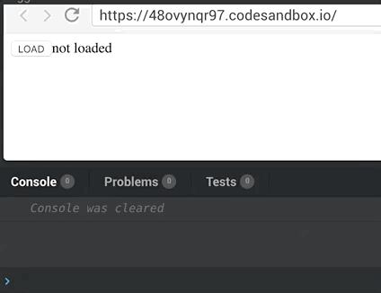

# React `useMiddleware` hook

[](https://www.npmjs.com/package/react-usemiddleware)


Redux compatible [middleware](https://redux.js.org/advanced/middleware) provider for React >=16.7 [Hooks](https://reactjs.org/docs/hooks-intro.html)

**react-useMiddleware** allows you to use [all existing Redux middlewares](https://github.com/xgrommx/awesome-redux#react---a-javascript-library-for-building-user-interfaces) with React's new feature called hooks.
It introduces new hook called `useMiddleware`, which is a wrapper around `useReducer`, but also allows you to pass an optional list of middlewares to be used.

## Install
```
$ npm install react-usemiddleware --save
$ yarn add react-usemiddleware
```

## API

You can use `useMiddleware` as a straight replacement for `useReducer`, and optionally pass 3rd parameter - an array of middlewares to be applied to a dispatch function.

```
 const [state, dispatch] = useMiddleware(reducer, initialState, middlewares = []);

```

Takes 3 parameters:
 - `reducer`, same as passed into `useReducer` hook
 - `initialState`, same as passed into `useReducer` hook
 - `middlewares` - array of middlewares, eg, `[thunk, createLogger, saga]`

## Example

```
import React from "react";
import ReactDOM from "react-dom";
import { useReducer, useEffect, useState } from "react";
import { applyMiddleware } from "redux";
import thunk from "redux-thunk";
import { createLogger } from "redux-logger";
import useMiddleware from "react-usemiddleware";

const logger = createLogger();
const middlewares = [thunk, logger];

const initState = {
  data: "not loaded"
};

const reducer = (state, action) => {
  switch (action.type) {
    case "LOAD":
      return { data: "loading..." };
    case "LOADED":
      return { data: action.payload };
    default:
      return state;
  }
};

const loadAction = () => async dispatch => {
  dispatch({ type: "LOAD" });
  const res = await fetch("https://jsonplaceholder.typicode.com/todos/1");
  const { title: payload } = await res.json();
  dispatch(loadedAction(payload));
};

const loadedAction = payload => {
  return { type: "LOADED", payload };
};

function App() {
  const [state, dispatch] = useMiddleware(reducer, initState, middlewares);
  return (
    <div className="App">
      <button onClick={() => dispatch(loadAction())}>LOAD</button>
      <span>{state.data}</span>
    </div>
  );
}
```

## Live example

A [live demo](https://codesandbox.io/s/48ovynqr97) can be found here




## Contributions

Please open an [Issue](https://github.com/venil7/react-usemiddleware/issues) or a [PR](https://github.com/venil7/react-usemiddleware/pulls)


